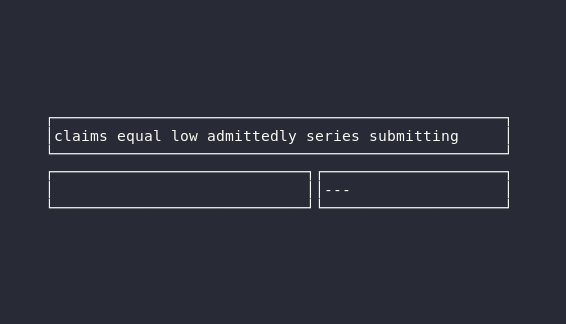

# wpm
A simple rust program to test typing speed.

Simply type the prompted words and your wpm will be calculated based on the 
characters typed within the time limit.




---

## Compilation

After ensuring that rustup is installed and a toolchain is set:
```
git clone https://github.com/RottenFishbone/wpm.git
cd wpm
cargo run --release
```

## Author
Jayden Dumouchel -- jdumouch@ualberta | rottenfishbone@pm.me

### Notes
At the moment this project is hard paused, I will likely pick it up again in the future when my schooling is done.

This is untested on windows but afaik it will compile and run correctly.
